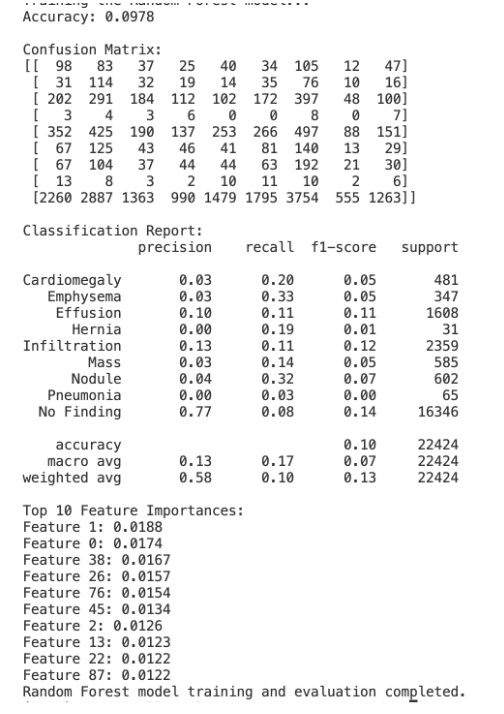

# Introduction
To assist radiologists in diagnosing lung diseases in patients, our team is working on using machine learning algorithms to analyze chest X-rays. AI models have been created with this goal, and are becoming commercially available. However, many of these models lack rigorous, peer-reviewed testing. When studies have been conducted, results have been mixed. Only last year, the University of Copenhagen Department of Radiology evaluated four commercially available AI tools for their performance; compared to a trained radiologist, the models were found to have higher false-positive rates and difficulty finding smaller targets. Clearly, the industry has room for improvement.

The dataset we are using consists of anonymized chest x-rays taken from 32,717 different patients, totaling over 108,000 total x-rays images. Some patients are healthy, while others are in different stages of eight possible lung diseases. Each image is labeled with the corresponding diagnosis from a radiologist.

# Problem Definition
Currently, lung disease is a leading cause of death in the United States, claiming the lives of over 150,000 Americans a year. In fact, 35 million Americans suffer from a chronic lung disease such as asthma. With this in mind, it is more important now than ever to be able to identify lung diseases accurately to ensure an early and prompt treatment. To help detect such disease, we propose a solution that takes a chest X-ray and identifies if it belongs to one of eight common lung diseases: Atelectasis, Cardiomegaly, Effusion, Infiltration, Mass, Nodule, Pneumonia, or Pneumothorax.

# Methods
### Data Pre-Processing Methods:
**For the tabular data:**
- **Data Cleaning** - Handling missing values, outlier detection.
- **Data Visualization** - Initial exploratory data analysis to understand the relationship between different lung disease classifications and number of follow-ups.
- **Dimensionality Reduction** - Employ principal component analysis to reduce the number of variables while preserving data integrity.
- **Feature Selection** - Create a correlation matrix or use statistical techniques to determine which features are significant predictors.

**For CT images:**
- **Segmentation** - Isolates regions from X-ray scans, allowing the algorithm to focus on specific areas.
- **Image Normalization** - Scales X-ray scans with varying intensity levels to reduce variability.
- **Dimensionality Reduction** - Uses principal component analysis to reduce the number of variables while preserving data integrity.

### Machine Learning Methods:
- **CNN** - Design architecture for image classification and detection. CNNs (convolutional neural networks) are ideal for image classification as they can automatically identify patterns through convolutional layers. We plan to use PyTorch to train the model.
- **SVM** - Multi-class image classification. Support vector machines are traditional machine learning algorithms for classification. We can use VGG16, a pre-built CNN, to extract features and feed them into the SVM. Scikit-learn will help implement SVMs for multi-classification.
- **Random Forest** - Image Classification. Random forests, an ensemble learning method, can use tabular data and extracted CT scan features to accurately classify lung disease types. Using Scikit-learn, we can plug the information into a random forest and train it.

# Results and Discussion
For this midterm, an accuracy of 9% was achieved. Initially, there was an issue of 'No Finding' being significantly overrepresented, with a 70% accuracy for this class alone, as most patients don't have any disease. To address this imbalance, we used SMOTE. A large number of features were present, so PCA was applied to maintain 95% of variance, eliminating the need to use potentially unnecessary features. To use the pre-trained CNN (ResNet18), the black and white images were converted to RGB. Additionally, the possibility of multiple diagnoses for some patients may have lowered accuracy by increasing the problem’s complexity. In the second iteration, the model no longer converged early, but accuracy dropped to 9%. This decrease is likely due to the general nature of random forests, which aren't ideal for image classification because they treat each feature/pixel independently and don’t effectively capture spatial relationships between pixels. Spatial relationships are critical since neighboring pixels are often related. Furthermore, image variations in scale and position likely contributed to random forests' poor performance. Moving forward, we plan to incorporate CheXNet, a CNN trained specifically on x-ray images to detect pneumonia. We believe CheXNet will significantly improve our accuracy, as it can likely detect diseases with similar x-ray visuals.

By the time of our final project submission, we aim to improve our pre-processing methods and expect this to enhance the accuracy of our random forest model.

# Contribution Table

| Name           | Midterm Contributions                                                                                                   |
|----------------|--------------------------------------------------------------------------------------------------------------------------|
| **Kevin Park** | Wrote the starting backbone code for developing the Random Forest algorithm. Collaborated closely with team members.    |
| **Srithan Nalluri** | Worked on the written portion, ensuring components are descriptive and up-to-date, and helped normalize images.    |
| **Sritan**     | Primarily worked on coding, testing, and debugging. Created the README file and uploaded all content to GitHub.         |
| **Maxi**       | Directed group work, organized work sessions, managed medical-related information, and found a CNN pre-trained on x-rays. |
| **Yiyang**     | Analyzed imbalance classification significance and conducted exploratory data analysis on meta-features and labels.      |
