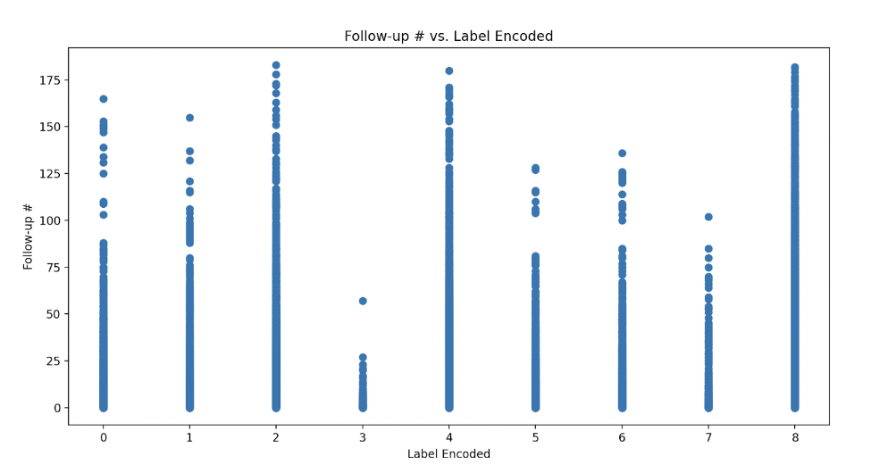
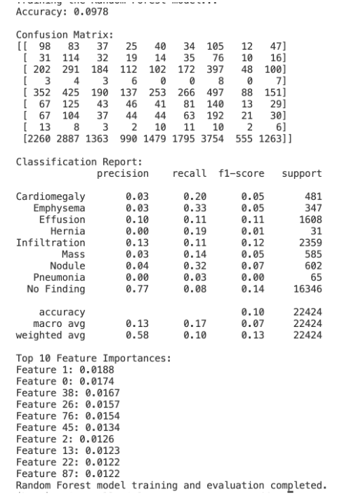
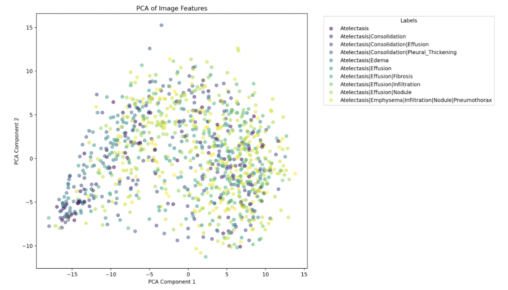
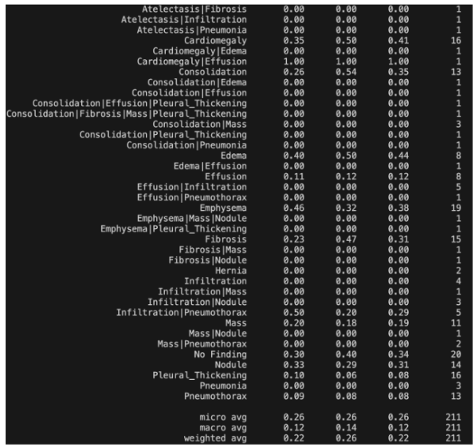
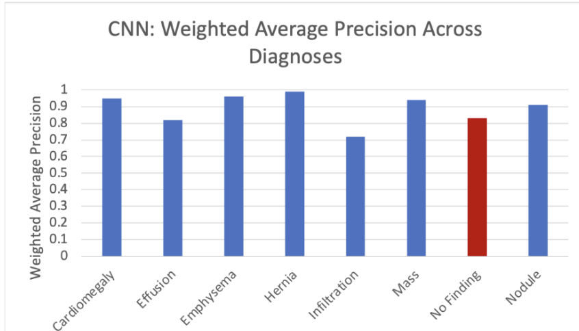
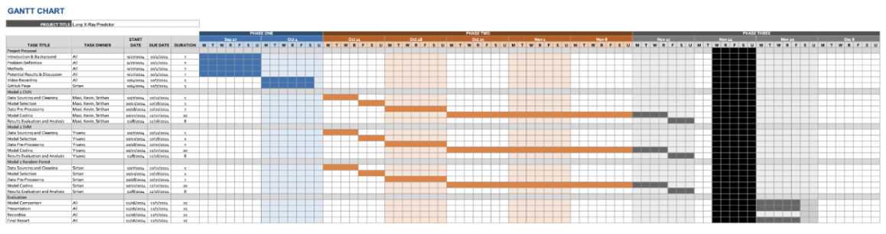

# Introduction
To assist radiologists in diagnosing lung diseases in patients, our team is working on using machine learning algorithms to analyze chest X-rays. AI models have been created with this goal, and are becoming commercially available. However, many of these models lack rigorous, peer-reviewed testing. When studies have been conducted, results have been mixed. Only last year, the University of Copenhagen Department of Radiology evaluated four commercially available AI tools for their performance; compared to a trained radiologist, the models were found to have higher false-positive rates and difficulty finding smaller targets. Clearly, the industry has room for improvement.

The dataset we are using consists of anonymized chest x-rays taken from 32,717 different patients, totaling over 108,000 total x-rays images.[3] Some patients are healthy, while others are in different stages of eight possible lung diseases. Each image is labeled with the corresponding diagnosis from a radiologist.

# Problem Definition
Currently, lung disease is a leading cause of death in the United States, claiming the lives of over 150,000 Americans a year. In fact, 35 million Americans suffer from a chronic lung disease such as asthma. With this in mind, it is more important now than ever to be able to identify lung diseases accurately to ensure an early and prompt treatment. To help detect such disease, we propose a solution that takes a chest x-ray and identifies if it belongs to one of eight common lung diseases: Atelectasis, Cardiomegaly, Effusion, Infiltration, Mass, Nodule, Pneumonia, or Pneumothorax. 

# Methods
### Data Pre-Processing Methods:
**For the tabular data:**
- **Data Cleaning** - Handling missing values, outlier detection.
- **Data Visualization** - Initial exploratory data analysis to understand the relationship between different lung disease classifications and number of follow-ups.
- **Dimensionality Reduction** - Employ principal component analysis to reduce the number of variables while preserving data integrity.
- **Feature Selection** - Create a correlation matrix or use statistical techniques to determine which features are significant predictors.

**For CT images:**
- **Segmentation** - Helps isolate regions from the X-ray scans and allow the algorithm to focus on a specific area 
- **Image Normalization** - X-ray scans with varying level of intensity should be normalized and scaled to reduce variability
- **Dimensionality Reduction** - Employ principal component analysis to reduce number of variables to select while preserving the integrity of the data.

### Machine Learning Methods:
- **CNN** - Design architecture for image classification and detection. CNNs are convolutional neural networks, which are primarily used for image classification, because through convolutional layers they are able to automatically identify specific patterns. We used torchxrayvision, a pre-built CNN specifically designed for chest x-rays.
- **SVM** - Multi-class image classification. Support vector machines are traditional machine learning algorithms for classification. We can use VGG16, a pre-built CNN, to extract the features and pass the features into the SVM. We can also use scikit-learn to use SVMs for multi-classification.
- **Random Forest** - Image Classification. Random forests is an ensemble learning method that is able to use tabular data, along with extracted features from CT scans to build models to accurately classify a specific lung disease type. Using scikit learn, we can plug the information into a random forest and train it.

# Results and Discussion
For the final project, an accuracy of 9% was achieved by Random Forest. Initially, a problem of ‘No Finding’ being significantly overrepresented had occurred (with a 70% accuracy for this), in that most patients don’t have any disease. Consequently, SMOTE was used as a resolution. A lot of features were present, and PCA was used to maintain 95% of variance while eliminating the need to use features that may be unnecessary. To use the pre-trained CNN (ResNet18), the black and white images needed to be converted to RGB. Furthermore, the possibility of some patients having multiple diagnoses may result in a lower accuracy due to the significant increase in the magnitude of the problem. In the second iteration, the result is fortunately no longer resulting in a convergence; however, the accuracy significantly decreased to 9%. This is because of the general nature of random forests not being ideal for image classification, as random forests consider each feature/pixel independently and thereby do not effectively determine pixels’ spatial relationships. Determining spatial relationships effectively is important because pixels and their neighbors are often related to each other. Furthermore, the images also vary in terms of scale and position, which could have also led to random forests not effectively handling these images well. 

**Image 1:** Random Forest Analytics

An accuracy of 26% was achieved by SVM (Support Vector Machine). This was much better than the Random Forest, and it is also better than random guessing. If we were to randomly guess, the accuracy would be 100/9 = 11.11%, so by having an accuracy of 26%, SVM had an accuracy of about 134% better than randomly guessing. This accuracy, however, was far below our expectations for a variety of reasons. The first is the fact that there is just so much sampling error due to multi-classification. Below in the first image are the features and labels we trained our support vector machine on. We applied principal component analysis to the features extracted by the pre-trained VGG model to reduce the dimension to two. The second image below is the output of a linear SVM model with the precision and recall of the model. Although the feature seems very messy, SVM is able to outperform random guessing in terms of classifying the labels.  
To improve the output of SVM, we hope to leverage multi-class SVM models with a better feature input. Due to computing constraints, we were unable to apply SVM to input data in high dimensions. We hope to reduce the dimensionality and leverage more advanced computing sources to classify the labels.

**Images 2 and 3:** SVM Analytics

With regards to the CNN implementation, the accuracy turned out to be 81%, which appears to be a commendable result. However, this high accuracy does not necessarily mean that the model is able to generalize well with unseen data, particularly due to the model having been influenced by an imbalance in the dataset. More specifically, 81% of the images in the dataset consisted of images with no lung disease, and this has likely led to the model developing a bias towards predicting “No Finding” (no finding of lung disease). Consequently, a high accuracy has been achieved, as the model converged correctly for the given data, but is not actually very useful due to the overrepresentation of “No Findings”. One way in which the imbalance in the dataset was attempted to be mitigated was with the use of the BCEWithLogitsLoss() function, as the pos_weight parameter helped penalize underrepresented classes more heavily when misclassification, thereby allowing the model to focus on the classes outside of “No Findings” and helping to reduce the bias towards the “No Findings” class. Unfortunately, this was still not enough to stop the model from converging to “No Findings,” despite our attempts to use SMOTE, designing training sets with equal amounts of each condition. 

**Image 4:** CNN Analytics

Overall, judging by pure accuracy alone, CNN would be the best algorithm to use; this is primarily due to the sampling method that we used. More specifically, the majority of the dataset consisted of “NaN” images, or “No Finding” images, which ultimately made the model converge and end up working wrongly. Along with the algorithms themselves, we tested out different training sampling for each one, which unfortunately now works as a confounding variable in our analysis. However, if we were talking about the model that performed truly the best of the 3 models, SVM is the algorithm which results in the best accuracy, while not falling into the sampling errors which CNN had. This is because SVM was slightly able to address the sampling problem by putting a limit on the max number of samples that could be used for each label (effectively limiting the number of samples for NaN to 100). Despite this, there was still some convergence of data from the SVM, but it was better than CNN and Random Forest.

We consider Random Forest to be the worst algorithm for this specific dataset. Since this is a computervision problem, the number of features is extremely high; moreover, due to the exact nature of our problem, no single feature captures a lot of the variance, as we found in our PCA analysis. Therefore, lacking much more pre-processing, Random Forest is not suited to this kind of problem. Another reason behind why Random Forests are not an ideal algorithm is that they treat each feature independently and do not determine spatial relationships between the pixels. Thus, there are a lot of issues with random forest in general that we predicted, as Random Forest is not generally recognized as a good algorithm for dealing with images.

Looking to future improvements, we are considering creating a new masking pre-processing system (similar to the happy/sad face problem we saw in class). For CNN specifically, we looked into running more epochs to give CNN more time to improve at identifying minority groups, but this would require more time on PACE. Furthermore, for all models, we need to create a better sampling algorithm that can be used to overcome the issues posed by the underrepresented classes. 

# Contribution Table

| Name           | Midterm Contributions                                                                                                   |
|----------------|--------------------------------------------------------------------------------------------------------------------------|
| **Kevin Park** | I worked to improve the code for SVM and CNN by extensive testing and modifications. I worked with our team to ensure that we were obtaining valid results from our models.   |
| **Srithan Nalluri** | I worked on the written portion of the project, along with ensuring that all components are descriptive and up-to-date, and also worked on the code to normalize the images. I also worked on the presentation.   |
| **Sritan**     | I heavily contributed to the report and figured out reasons for why the code was not working. I also worked on the CNN and SVM code, testing and making changes whenever there were issues. I also made the README file and put everything onto Github.         |
| **Maxi**       | I directed group work and organized work sessions. I wrote the CNN code, performed pre-processing, and connected it to torchxrayvision. |
| **Yiyang**     | Worked on the SVM model, creating data sampling method, linking VGG to dimensionality reduction to SVM model. Created visualization methods to validate the sampling methods and model results.      |

# References #
K. G. van Leeuwen, S. Schalekamp, M. J. C. M. Rutten, B. van Ginneken, and M. de Rooij, “Artificial intelligence in radiology: 100       
commercially available products and their scientific evidence,” European Radiology, vol. 31, no. 6, pp. 3797–3804, Apr. 2021, doi: https://doi.org/10.1007/s00330-021-07892-z

Louis Lind Plesner et al., “Commercially Available Chest Radiograph AI Tools for Detecting Airspace Disease, Pneumothorax, and Pleural Effusion,” Radiology, vol. 308, no. 3, Sep. 2023, doi: https://doi.org/10.1148/radiol.231236.

“NIH Clinical Center provides one of the largest publicly available chest x-ray datasets to scientific community,” National Institutes of Health (NIH), Sep. 27, 2017. Available: https://www.nih.gov/news-events/news-releases/nih-clinical-center-provides-one-largest-publicly-available-chest-x-ray-datasets-scientific-community

“About Us: Our Impact,” www.lung.org, Sep. 16, 2024. Available: https://www.lung.org/about-us/our-impact
